# Financial RAG — Equity Research System

Free, fully local vector DB + Groq (free cloud LLM) — no GPU, no paid APIs.

## Stack
| Component | Tool | Cost |
|---|---|---|
| PDF parsing | pdfplumber | Free |
| Embeddings | sentence-transformers (CPU) | Free |
| Vector DB | ChromaDB (local on disk) | Free |
| Re-ranker | ms-marco-MiniLM (CPU) | Free |
| LLM | Groq API (llama-3.3-70b) | Free tier |
| Metadata DB | SQLite | Free |

## Architecture

### High-Level Architecture


### Low-Level Pipeline Design

### Structured-Semantic Fusion RAG


This architecture utilizes atomic decomposition to route queries through a Schema Bridge, bridging the gap between SQLite and Vector DB. By executing parallel retrievals and using a dedicated Fusion Layer to cross-reference quantitative stats with qualitative narratives, the system ensures high-fidelity attribution. Final responses are generated via typed templates to deliver structured, data-driven financial insights.

## Directory Structure
```
Financial-Rag/
├── config/
│   └── settings.py          # All config in one place
├── db/
│   └── database.py          # SQLite schema + helpers
├── pipeline/
│   ├── extract/
│   │   ├── pdf_extractor.py     # Parse PDF → structured text
│   │   └── text_cleaner.py      # Clean + normalize text
│   ├── loader/
│   │   ├── chunker.py           # Chunking strategies (annual vs concall)
│   │   ├── embedder.py          # sentence-transformers embedding
│   │   └── chroma_loader.py     # Write chunks → ChromaDB
│   └── retrieval/
│       ├── retriever.py         # Hybrid search (vector + BM25)
│       └── reranker.py          # Cross-encoder re-ranking
├── rag/
│   └── rag_engine.py        # Groq LLM + prompt builder
├── utils/
│   └── logger.py            # Structured logging
├── ingest.py                # CLI: run full ingestion pipeline
├── query.py                 # CLI: ask questions
├── screener_downloader.py   # (existing) scrape PDFs
└── requirements.txt
```

## Setup

```bash
# 1. Clone and install
pip install -r requirements.txt

# 2. Get free Groq API key
# → https://console.groq.com/  (no credit card, generous free tier)

# 3. Set env var
export GROQ_API_KEY="gsk_xxxxxxxxxxxx"

# 4. Download PDFs for a company
python screener_downloader.py RELIANCE

# 5. Ingest into RAG
python ingest.py --symbol RELIANCE
python ingest.py --symbol RELIANCE --type concall   # only concalls
python ingest.py --symbol RELIANCE --type annual    # only annual reports

# 6. Query
python query.py --symbol RELIANCE "What is the revenue growth trend over last 3 years?"
python query.py --symbol RELIANCE --type concall "What did management say about capex guidance?"
python query.py  "Compare Reliance and ADANIPORTS debt levels"  # cross-company
```

## Groq Free Tier
- 14,400 requests/day
- 6,000 tokens/minute  
- Models: llama-3.3-70b-versatile, gemma2-9b-it
- No credit card required