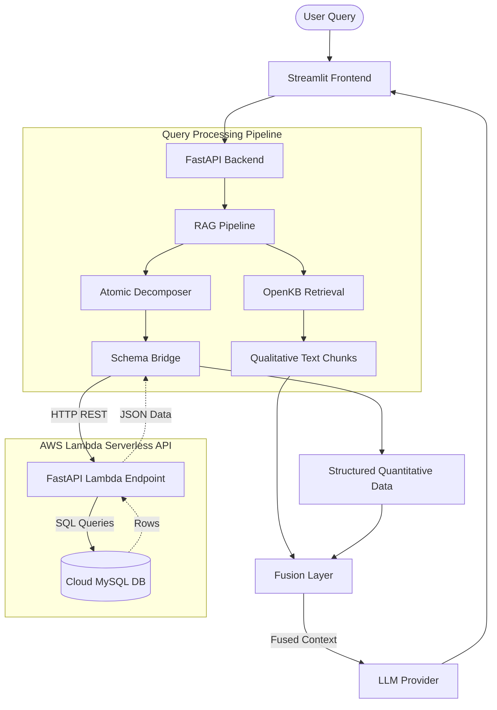

# Financial RAG Platform 📈

**Purpose**: An advanced, hybrid Retrieval-Augmented Generation (RAG) platform tailored for financial and equity research. This system fuses **qualitative keyword search (OpenKB)** (reading earnings call transcripts) with **quantitative SQL data extraction** (fetching raw balance sheet and P&L data via AWS Lambda REST APIs) to generate highly accurate, mathematically grounded financial analysis.


## Architecture & Data Flow

This platform dynamically routes user queries into two concurrent streams to eliminate LLM hallucinations:

1. **Decomposition & Schema Bridge (Quantitative)**: The Atomic Decomposer parses the user's query for financial metrics (e.g. ROCE, Revenue, EBITDA). The Schema Bridge translates these into exact HTTP requests against our live AWS Lambda Financial API, extracting structured data (rows and columns).
2. **OpenKB Keyword Retrieval (Qualitative)**: Simultaneously searches local document chunks for qualitative context (management guidance, qualitative outlook, forward-looking statements).
3. **Fusion Layer**: The structured SQL data and the qualitative text chunks are merged and verified for contradictions.
4. **Prompt Builder & Synthesis**: The fused data is formatted into a dense context prompt. Finally, the LLM generates a comprehensive, mathematically-accurate summary using the verified figures.

### Interactive Architecture Diagram


```mermaid
flowchart TD
    User([User Query]) --> Streamlit[Streamlit Frontend]
    Streamlit --> FastAPI[FastAPI Backend]

    subgraph Backend [Query Processing Pipeline]
        FastAPI --> Pipeline[RAG Pipeline]
        
        Pipeline --> OpenKB[OpenKB Retrieval]
        OpenKB --> Chunks[Qualitative Text Chunks]
        
        Pipeline --> Decomposer[Atomic Decomposer]
        Decomposer --> Bridge[Schema Bridge]
    end

    subgraph AWS [AWS Lambda Serverless API]
        Bridge -- HTTP REST --> Lambda[FastAPI Lambda Endpoint]
        Lambda -- SQL Queries --> MySQL[(Cloud MySQL DB)]
        MySQL -. Rows .-> Lambda
        Lambda -. JSON Data .-> Bridge
    end

    Bridge --> SQLData[Structured Quantitative Data]
    
    Chunks --> Fusion[Fusion Layer]
    SQLData --> Fusion
    
    Fusion -- Fused Context --> LLM[LLM Provider]
    LLM --> Streamlit
```

### 🏆 API Acknowledgment
The core APIs powering the structured financial extraction are adapted from the [Quant_CoPilot-Equity-Research-Agent-ETL](https://github.com/Import-Saurabh/Quant_CoPilot-Equity-Research-Agent-ETL) repository.

---

## Setup Guide

### 1. Environment Setup
1. Clone the repository.
2. Create a virtual environment and activate it:
   ```bash
   python -m venv .venv
   # Windows
   .\.venv\Scripts\activate  
   # macOS/Linux
   source .venv/bin/activate
   ```
3. Install dependencies:
   ```bash
   pip install -r requirements.txt
   ```
4. Set up your environment variables (e.g., API keys for Groq, DeepSeek, OpenRouter):
   ```bash
   $env:GROQ_API_KEY="your_api_key_here"
   ```

### 2. Launching the Services

The application requires two main processes running simultaneously (the database and ETL are handled remotely via AWS Lambda).

**Terminal 1: Start the FastAPI Backend**
```bash
.\.venv\Scripts\python backend/server.py
```

**Terminal 2: Start the Streamlit Frontend**
```bash
.\.venv\Scripts\python -m streamlit run frontend/app.py
```

### 3. Usage & Testing

Once both services are running, open your browser to http://localhost:8501. 

**Example Queries to try:**
- *What is the profit growth yoy Apollo microsystem?*
- *What is the shareholding pattern for Apollo Microsystems?*
- *Show me the cash flow statement for Apollo Microsystems.*
- *What is the stock price and technical indicators for Apollo Microsystems?*

The system will automatically detect the symbol (`APOLLO`), fetch the quantitative data from the AWS Lambda endpoints, retrieve the text transcripts, and generate a comprehensive financial summary.
