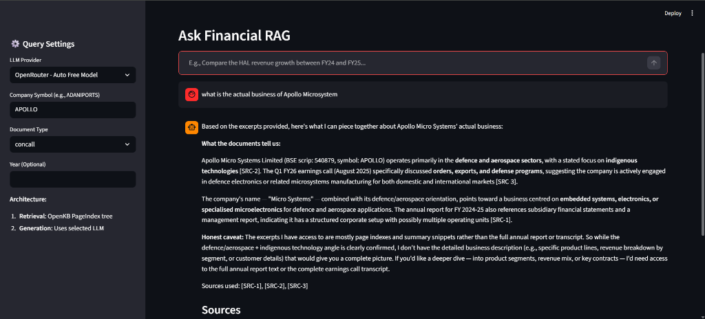

# Financial RAG Platform ??

An advanced, hybrid Retrieval-Augmented Generation (RAG) platform tailored for financial and equity research. This system fuses **qualitative semantic search** (reading earnings call transcripts) with **quantitative SQL data extraction** (fetching raw balance sheet and P&L data) to generate highly accurate, mathematically grounded financial analysis.

## Architecture Overview

This platform dynamically routes user queries into two concurrent streams:
1. **Vector Retrieval**: Searches local document chunks for qualitative context (management guidance, qualitative outlook).
2. **SQL MCP Bridge**: Decomposes queries into exact financial data requirements (e.g. ROCE, Revenue, EBITDA), extracting the exact rows from a MySQL database using a Model Context Protocol (MCP) server.

The structured SQL data and the qualitative text chunks are fused together into a unified context prompt, which is then fed into an LLM for final generation.

`mermaid
flowchart TD
    User([User Query]) --> Streamlit[Streamlit Frontend]
    Streamlit --> FastAPI[FastAPI Backend]

    subgraph Backend [Query Processing Pipeline]
        FastAPI --> Pipeline[RAG Pipeline]
        
        Pipeline --> Vector[Keyword / Vector Retrieval]
        Vector --> Chunks[Text Chunks]
        
        Pipeline --> Decomposer[Atomic Decomposer]
        Decomposer --> MCPBridge[Schema Bridge]
    end

    subgraph MCP [Model Context Protocol Server]
        MCPBridge -- Tools --> MCPServer[MCP FastAPI Server]
        MCPServer -- SQL Queries --> MySQL[(MySQL DB)]
        MySQL -. Rows .-> MCPServer
        MCPServer -. JSON Data .-> MCPBridge
    end

    MCPBridge --> SQLData[Structured Data]
    
    Chunks --> Fusion[Fusion Layer]
    SQLData --> Fusion
    
    Fusion --> LLM[LLM Provider]
    LLM --> Streamlit
`

### ?? API Acknowledgment
The core APIs powering the MCP server for structured financial extraction are adapted from the [Quant_CoPilot-Equity-Research-Agent-ETL](https://github.com/Import-Saurabh/Quant_CoPilot-Equity-Research-Agent-ETL) repository.

## Setup Guide

### 1. Environment Setup
1. Clone the repository.
2. Create a virtual environment and activate it:
   `ash
   python -m venv .venv
   .\.venv\Scripts\activate  # Windows
   `
3. Install dependencies:
   `ash
   pip install -r requirements.txt
   `
4. Create your .env file from the example:
   `ash
   cp .env.example backend/.env
   `
   *Edit the .env file to add your preferred LLM API keys (e.g., OpenRouter, Groq, DeepSeek).*

### 2. Database Setup
Ensure you have a MySQL server running with the Financial Data schema. The default configuration expects MySQL on 127.0.0.1:3307. 

### 3. Launching the Services
The application requires three processes running simultaneously:

**Terminal 1: Start the MCP Server**
`ash
.\.venv\Scripts\python backend/mcp_server.py --sse
`

**Terminal 2: Start the FastAPI Backend**
`ash
.\.venv\Scripts\python backend/server.py
`

**Terminal 3: Start the Streamlit Frontend**
`ash
.\.venv\Scripts\python -m streamlit run frontend/app.py
`

### 4. Usage
Once all three services are running, open your browser to http://localhost:8501. 
- Type a query like *What is the revenue and profit trend for APOLLO from FY23 to FY25?*
- The system will automatically detect the symbol (APOLLO), fetch the quantitative data, retrieve the text transcripts, and generate a comprehensive financial summary.
